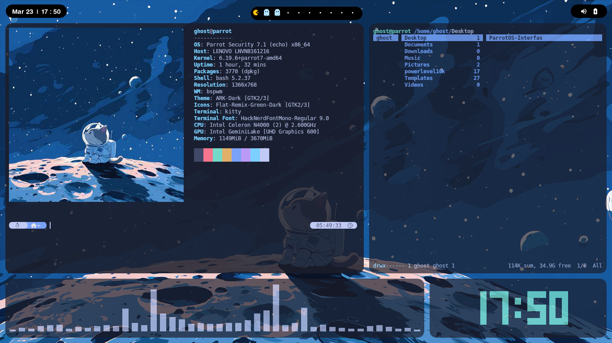

# ParrotOS-Interfas

## Descripción

Script de automatización para configurar un entorno completo en Parrot OS desde cero.
Incluye instalación de herramientas, configuración del sistema y personalización del entorno para pentesting y uso diario.

---

## ⚙️ Características

* 🔄 Actualización automática del sistema
* 📦 Instalación de paquetes esenciales
* 🛠️ Configuración de entorno (bspwm, polybar, etc.)
* 🎨 Personalización (wallpaper, temas, fuentes)
* ⚡ Optimización del sistema

---

## 📸 Preview



---

## 🛠️ Requisitos

* Sistema basado en Debian (Recomendado: Parrot OS)
* Conexión a internet
  
---

## 📥 Instalación

```bash
git clone https://github.com/brayan-arriaga/ParrotOS-Interfas.git
cd ParrotOS-Interfas
chmod +x install.sh
./install.sh
```

---

## 🚀 Uso

Ejecuta el script principal:

```bash
./install.sh
```

Sigue las instrucciones en pantalla.

---

## ⚠️ Advertencias

* Este script realiza cambios en el sistema
* Puede sobrescribir configuraciones existentes
* Usar bajo tu propio riesgo

---

## 🧪 Tecnologías utilizadas

* Bash scripting
* Linux (Parrot OS)

---

## 🧠 Objetivo del proyecto

Automatizar la configuración de entornos de trabajo para ahorrar tiempo y evitar errores manuales en instalaciones repetitivas.

---

## 👨‍💻 Autor

* brayan-arevalo


